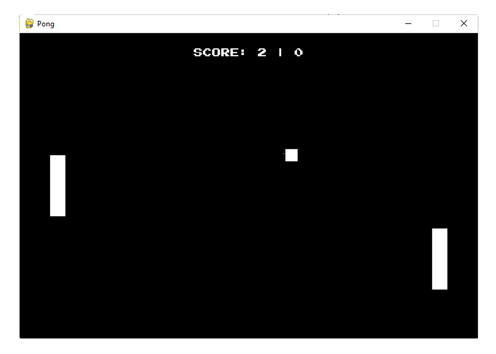

# Pong

This pong program allows the player to compete against an AI (the right paddle) and includes a scoring system, win condition and key controls.

## Dependencies

<ul>
<li>Pygame</li>
</ul>

## Languages

